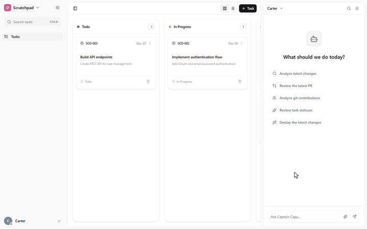
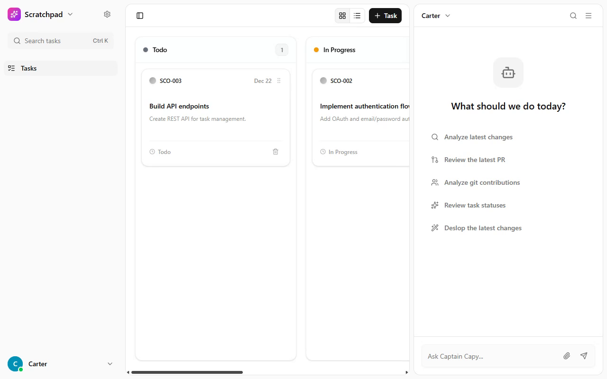

# Capy UI Clone

A task-management interface prototype inspired by Capy, with a task workspace and a companion chat panel.

## Demo



<details>
<summary>Screenshot</summary>



</details>

[Live demo](https://capy-ui-clone.vercel.app)

## What it does

- Create and edit tasks in a modal.
- Organize tasks in board and list views with drag-and-drop interactions.
- Change layout and display settings.
- Open the command menu to navigate the interface.

## Run locally

Use Node.js 20.9+ and npm.

```bash
git clone https://github.com/SpyC0der77/capy-ui-clone.git
cd capy-ui-clone
npm ci
npm run dev
```

Open [localhost:3000](http://localhost:3000).

## Commands

| Command | Purpose |
| --- | --- |
| `npm run dev` | Start the development server |
| `npm run build` | Build the production app |
| `npm run start` | Serve a production build |
| `npm run lint` | Run ESLint |

Run `build` before `start`.

## Dependencies and limitations

Tasks use client-side React state and reset on reload. Display settings are saved in local storage. The chat panel is a UI mockup; there is no AI provider, authentication service, or shared task backend.

## Source layout

- [`src/components/task-panel.tsx`](src/components/task-panel.tsx): Task workspace.
- [`src/components/chat-panel.tsx`](src/components/chat-panel.tsx): Chat mockup.
- [`src/contexts/tasks-context.tsx`](src/contexts/tasks-context.tsx): Demo tasks and state.
- [`src/contexts/settings-context.tsx`](src/contexts/settings-context.tsx): Saved display settings.
